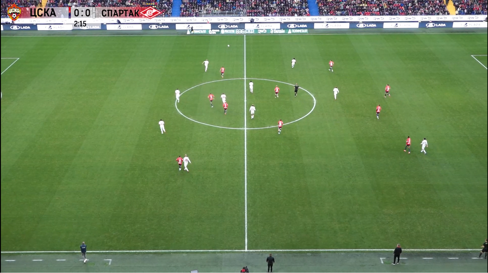

<div align="center">


# LTPI: A Benchmark for Long-term Player Identification from Single-Camera Football Video

</div>

>**[LTPI: A Benchmark for Long-term Player Identification from Single-Camera Football Video](https://openaccess.thecvf.com/content/CVPR2026W/CVsports/html/Dusov_LTPI_A_Benchmark_for_Long-term_Player_Identification_from_Single-Camera_Football_CVPRW_2026_paper.html)**
>
>Murad Dusov, Vasiliy Chelpanov, Andrey Sakhovskiy, Vadim Linkov, Oleg Durygin, Mikhail Moiseev, Matvey Isupov, Konstantin Mitin, Semen Budennyy
>

<div align="center">



<sub>Sample frame from the LTPI dataset — single tactical broadcast camera.</sub>

</div>

## About

This is the official repository of our work LTPI, accepted at [CVSports'26](https://vap.aau.dk/cvsports/), which allows you to reproduce the results presented in the paper. The repository is based on the [Tracklab](https://github.com/TrackingLaboratory/tracklab) framework and uses some [SoccerNet](https://github.com/SoccerNet/sn-gamestate) modules, which are also based on Tracklab. In addition, we integrate Koshkina's [jersey number recognition pipeline](https://github.com/mkoshkina/jersey-number-pipeline) as a Tracklab module and implement team classification and simple identification modules. Due to a lack of time, the final part of the paper is provided in the form of Python scripts in the corresponding directory; for detailed launch instructions, see the "Run" section below.

## Dataset

A full-match recording (Full HD, 30 FPS) from a tactical broadcast camera, split into two halves. The second half contains more substitutions, which makes identification progressively harder.

| Metric | 1st Half | 2nd Half |
|---|---:|---:|
| Duration (min) | 49.6 | 51.4 |
| Frames | 89,354 | 92,503 |
| Total detections | 1,804,646 | 1,885,566 |
| Unique tracks | 23 | 28 |
| Track fragments | 1,616 | 1,471 |
| Avg. fragment length (s) | 44.7 | 51.3 |
| Team A / B players | 12 / 11 | 15 / 13 |
| Avg. detections / frame | 20.2 | 20.4 |

## Results

Baseline performance, evaluated with the Cost-Sensitive Identification Score (CSIS) along with Coverage, MisID and UNK rate. Thresholds are tuned on the first half (val) and final performance is reported on the second half (test). $\uparrow$ / $\downarrow$ denote higher / lower is better.

| Split | CSIS $\uparrow$ | Coverage $\uparrow$ | MisID $\downarrow$ | UNK $\downarrow$ |
|---|---:|---:|---:|---:|
| First Half (val) | 0.739 | 0.855 | 0.188 | 0.145 |
| Second Half (test) | 0.716 | 0.780 | 0.174 | 0.220 |

Ablation over the information sources used by the identification pipeline (reported on the second half):

| Jersey | Visual | Lineup | CSIS $\uparrow$ | Coverage $\uparrow$ | MisID $\downarrow$ | UNK $\downarrow$ |
|:---:|:---:|:---:|---:|---:|---:|---:|
| &check; | &cross; | &cross; | 0.501 | 0.151 | 0.074 | 0.849 |
| &cross; | &check; | &cross; | 0.704 | 0.825 | 0.208 | 0.175 |
| &cross; | &check; | &check; | 0.716 | 0.781 | 0.174 | 0.219 |
| &check; | &check; | &check; | 0.709 | 0.790 | 0.186 | 0.210 |

## Run
### Clone this repository:
```bash
git clone git@github.com:FrontierSport/ltpi-benchmark.git
```
### Install it using conda:
```bash
conda create -n ltpi python=3.10 -y
conda activate ltpi
cd ltpi-benchmark
pip install -e .
pip install git+https://github.com/KaiyangZhou/deep-person-reid.git --no-build-isolation
```
### Download dataset:
Download LTPI [dataset](https://1drv.ms/u/c/ce01e4470f3ec4d9/IQDoHSrH81ztS4yRKW-KjkY3Adf6oZaiZhejdKB9LdWJKBQ?e=bySKb2) and set source_path in ltpi.yaml

### Download weights to ltpi-benchmark/pretrained_models:
- Finetuned on 60 seconds [PRTReID](https://1drv.ms/u/c/ce01e4470f3ec4d9/IQD6F0hv_vd1RJECVa49paG-AWBq75TijMtojWxVQzVpuCA?e=g0SzW3)  
- Koshkina's [Legibility Classifier](https://drive.google.com/file/d/18HAuZbge3z8TSfRiX_FzsnKgiBs-RRNw/view?usp=sharing)  
- Koshkina's [ViTPose](https://1drv.ms/u/s!AimBgYV7JjTlgShLMI-kkmvNfF_h?e=dEhGHe)  
- Finetuned [PARSeq](https://1drv.ms/u/c/ce01e4470f3ec4d9/IQDxb07orFibTJrknyqL7pFeAXe_o6Ia696LIM4Wrqley8U?e=kqshpI)  
- [Team classifier](https://1drv.ms/u/c/ce01e4470f3ec4d9/IQDUIt_CTZNFRrsMkG8iSuANAZndreCXo7iZDB-M3ud189c?e=uLjwCP)  


### Run first part of pipeline:
```bash
python -m tracklab.main -cn ltpi
```

### Run second part of pipeline:
Outputs of first part will be located in outputs/ltpi/{run date}/{run time}/states. Copy this path and run the following command.
```bash
python scripts/score_ltpi.py --results-dir <path> 
```

## Citation
```
@inproceedings{dusov2026ltpi,
  title={LTPI: A Benchmark for Long-term Player Identification from Single-Camera Football Video},
  author={Dusov, Murad and Chelpanov, Vasiliy and Sakhovskiy, Andrey and Linkov, Vadim and Durygin, Oleg and Moiseev, Mikhail and Isupov, Matvey and Mitin, Konstantin and Budennyy, Semen},
  booktitle={Proceedings of the IEEE/CVF Conference on Computer Vision and Pattern Recognition},
  pages={9919--9929},
  year={2026}
}
```

## Acknowledgements

This repository builds on and integrates the following projects:

- [Tracklab](https://github.com/TrackingLaboratory/tracklab) — tracking framework.
- [SoccerNet Game State Reconstruction](https://github.com/SoccerNet/sn-gamestate) — game-state modules, based on Tracklab.
- [PRTreID](https://github.com/VlSomers/prtreid) — re-identification backbone.
- [PARSeq](https://github.com/baudm/parseq) — scene text recognition.
- [ViTPose](https://github.com/ViTAE-Transformer/ViTPose) — pose estimation.
- [A General Framework for Jersey Number Recognition in Sports](https://github.com/mkoshkina/jersey-number-pipeline) — jersey number recognition, integrated as a Tracklab module.

We thank the authors of these works.

## License

The code in this repository is released under the
[Creative Commons Attribution-NonCommercial 4.0 International](https://creativecommons.org/licenses/by-nc/4.0/)
license — see [`LICENSE`](LICENSE).

**Dataset.** The LTPI dataset is provided for **non-commercial research use only** and is subject to its own terms, separate from this code.
